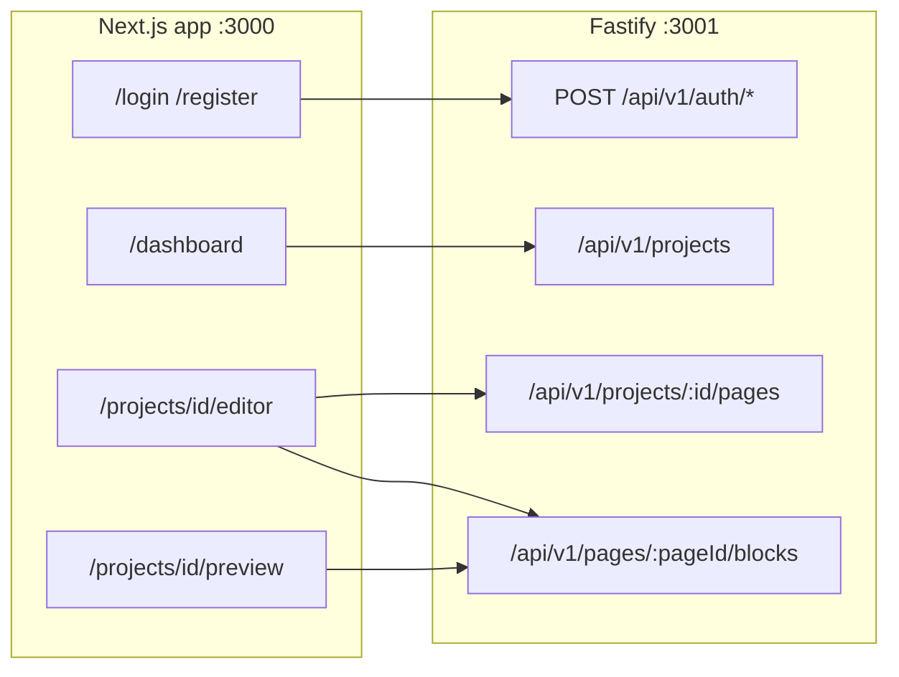
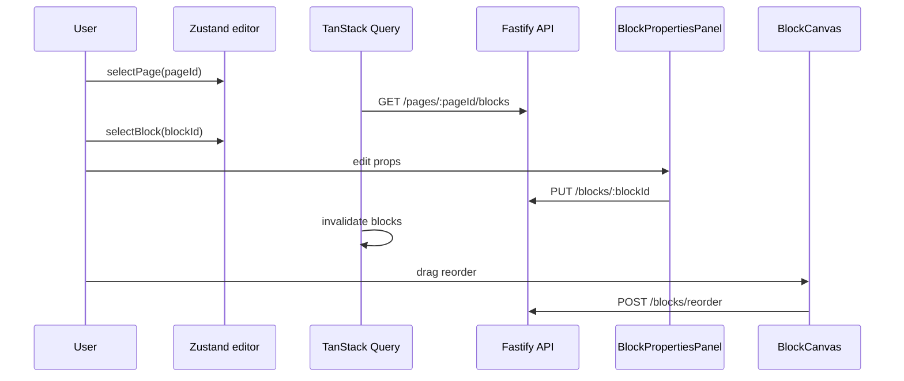

# Plan — Structure complète frontend webplatform-app

## Contexte actuel

- [`webplatform-app`](c:\xampp\htdocs\env\webplatform-app) est **vide** (uniquement `.cursor/` — pas de `package.json`, pas de `src/`).
- Backend prêt dans [`node-apps/webplatform`](c:\xampp\htdocs\env\node-apps\webplatform) : Fastify port **3001**, base **`/api/v1`**, JWT `Authorization: Bearer <token>`, payload `{ id, email, tenant_id }`.
- Types canoniques à copier **à l'identique** depuis [`node-apps/webplatform/src/types/index.ts`](c:\xampp\htdocs\env\node-apps\webplatform\src\types\index.ts) (~725 lignes : `BlockType`, 23 interfaces props, `BlockProps`, `Tenant`, `Project`, `Page`, `Block`, helpers `PHASE_1_BLOCKS`, `isBlockType`, etc.).
- CORS backend attend : prod `https://app.kdevs.io`, dev `http://localhost:3000`.



---

## Phase 0 — Initialisation projet

### 0.1 Scaffold Next.js 15

```bash
npx create-next-app@latest . --typescript --tailwind --eslint --app --src-dir --import-alias "@/*"
```

Dans le dossier existant `webplatform-app` (conserver `.cursor/`).

### 0.2 Dépendances

| Package                                                      | Rôle                                               |
| ------------------------------------------------------------ | -------------------------------------------------- |
| `zustand`                                                    | Auth JWT + état éditeur                            |
| `@tanstack/react-query`                                      | Cache/fetch API                                    |
| `@dnd-kit/core` + `@dnd-kit/sortable` + `@dnd-kit/utilities` | Drag & drop blocs                                  |
| `shiki`                                                      | Bloc `code` (seul bloc avec coloration syntaxique) |
| `zod`                                                        | Validation formulaires auth                        |

### 0.3 Config TypeScript / Tailwind v4

- [`tsconfig.json`](tsconfig.json) : `"strict": true`, paths `@/*` → `./src/*`.
- Tailwind v4 (déjà inclus par create-next-app récent) :
  - [`src/app/globals.css`](src/app/globals.css) : `@import "tailwindcss";` + variables CSS design system (couleurs, fonts).
  - [`postcss.config.mjs`](postcss.config.mjs) : plugin `@tailwindcss/postcss`.
  - **Aucune** classe Tailwind dans le JSX — uniquement `@apply` dans les `.module.css` (règle [`core-standards.md`](c:\xampp\htdocs\env\webplatform-app.cursor\rules\core-standards.md)).

### 0.4 Variables d'environnement

Créer [`.env.example`](.env.example) :

```env
NEXT_PUBLIC_API_URL=http://localhost:3001/api/v1
NEXT_PUBLIC_APP_URL=http://localhost:3000
```

Prod (Coolify) : `https://api.webplatform.kdevs.io/api/v1` et `https://app.kdevs.io`.

---

## Phase 1 — Fondations (`src/lib`, `src/types`, `src/store`)

### 1.1 [`src/types/index.ts`](src/types/index.ts)

Copier **intégralement** le fichier backend (sans l'export `LlmTask` qui dépend de `../lib/llm.js` — le frontend n'en a pas besoin).

Points critiques à préserver :

- Snake_case (`tenant_id`, `order_index`, `cta_label`…)
- `Block.props` (pas `content`)
- `Page` sans `updated_at`
- Union `BlockProps` + 23 interfaces membres

### 1.2 [`src/lib/api.ts`](src/lib/api.ts)

Client HTTP typé centralisé :

```typescript
const BASE = process.env.NEXT_PUBLIC_API_URL!;

export class ApiError extends Error {
  constructor(public status: number, message: string) { super(message); }
}

const request = async <T>(path: string, options?: RequestInit & { token?: string }): Promise<T> => { /* fetch + ApiError */ };

export const api = {
  get: <T>(path: string, token?: string) => request<T>(path, { token }),
  post: <T>(path: string, body: unknown, token?: string) => ...,
  put: <T>(path: string, body: unknown, token?: string) => ...,
  patch: <T>(path: string, body: unknown, token?: string) => ...,
  delete: (path: string, token?: string) => ...,
};
```

- Préfixe `/api/v1` **déjà dans** `NEXT_PUBLIC_API_URL` (évite la duplication).
- Header `Authorization: Bearer ${token}` injecté automatiquement.
- Parse JSON + throw `ApiError` sur status ≥ 400.

### 1.3 [`src/store/auth.ts`](src/store/auth.ts) — Zustand

```typescript
interface AuthUser {
  id: string;
  email: string;
  tenant_id: string;
}

interface AuthState {
  token: string | null;
  user: AuthUser | null;
  isHydrated: boolean;
  login: (email: string, password: string) => Promise<void>;
  register: (email: string, password: string, name: string) => Promise<void>;
  logout: () => void;
  hydrate: () => void;
}
```

- Persistance JWT dans `localStorage` (clé `webplatform_token`).
- `hydrate()` appelé côté client au mount (via provider) pour restaurer la session.
- Appels : `POST /auth/login`, `POST /auth/register` → `{ token, user }`.

### 1.4 [`src/store/editor.ts`](src/store/editor.ts) — Zustand éditeur

État UI local (pas les données serveur — celles-ci passent par TanStack Query) :

```typescript
interface EditorState {
  projectId: string | null;
  selectedPageId: string | null;
  selectedBlockId: string | null;
  isPreviewMode: boolean;
  selectPage: (id: string) => void;
  selectBlock: (id: string | null) => void;
  reset: () => void;
}
```

### 1.5 Providers & layout racine

- [`src/app/providers.tsx`](src/app/providers.tsx) (`'use client'`) : `QueryClientProvider` + hydration auth.
- [`src/app/layout.tsx`](src/app/layout.tsx) : metadata, fonts, import `globals.css`, wrap `<Providers>`.
- [`src/middleware.ts`](src/middleware.ts) : redirect `/` → `/dashboard` si token cookie/header, sinon `/login`.  
  **Note** : comme le JWT est en `localStorage`, le middleware Next.js ne peut pas le lire directement. Stratégie retenue :
  - Routes protégées wrappées par un composant client `AuthGuard` qui redirige si pas de token.
  - Middleware léger pour routes publiques (`/login`, `/register`) : redirect vers `/dashboard` si cookie `webplatform_token` est posé en parallèle du localStorage (sync au login).

---

## Phase 2 — Couche API features (TanStack Query)

Organisation feature-based ([`mcp-architecture.md`](c:\xampp\htdocs\env\webplatform-app.cursor\rules\mcp-architecture.md)) :

```
src/features/
├── auth/
│   ├── components/LoginForm/
│   ├── components/RegisterForm/
│   └── hooks/useAuth.ts          # wrapper store Zustand
├── projects/
│   ├── components/ProjectCard/
│   ├── components/ProjectList/
│   ├── hooks/useProjects.ts      # useQuery GET /projects
│   └── services/projectsApi.ts
├── pages/
│   ├── components/PageTree/
│   ├── hooks/usePages.ts         # CRUD + reorder
│   └── services/pagesApi.ts
├── blocks/
│   ├── components/BlockCanvas/
│   ├── components/BlockPropertiesPanel/
│   ├── components/blocks/        # 1 composant par BlockType
│   ├── hooks/useBlocks.ts        # CRUD + reorder
│   └── services/blocksApi.ts
└── editor/
    ├── components/EditorLayout/
    ├── components/EditorSidebar/
    └── components/EditorToolbar/
```

### Hooks TanStack Query clés

| Hook                  | Endpoint                    | Invalidation        |
| --------------------- | --------------------------- | ------------------- |
| `useProjects()`       | `GET /projects`             | après create/delete |
| `useProject(id)`      | `GET /projects/:id`         | après update        |
| `usePages(projectId)` | `GET /projects/:id/pages`   | après CRUD/reorder  |
| `useBlocks(pageId)`   | `GET /pages/:pageId/blocks` | après CRUD/reorder  |

Mutations avec `useMutation` + `queryClient.invalidateQueries`.

---

## Phase 3 — Pages App Router

### Arborescence routes

```
src/app/
├── layout.tsx
├── page.tsx                    → redirect /dashboard ou /login
├── login/page.tsx
├── register/page.tsx
├── dashboard/page.tsx
└── projects/[id]/
    ├── editor/page.tsx
    └── preview/page.tsx
```

Chaque `page.tsx` = Server Component mince qui délègue à un composant client feature.

### 3.1 `/login` et `/register` (Priorité 1)

- [`LoginForm`](src/features/auth/components/LoginForm/LoginForm.tsx) : email + password, erreurs API, redirect `/dashboard` au succès.
- [`RegisterForm`](src/features/auth/components/RegisterForm/RegisterForm.tsx) : email + password + name.
- Layout auth centré ([`AuthLayout`](src/shared/components/AuthLayout/)) avec logo/titre.

### 3.2 `/dashboard` (Priorité 2)

- Liste projets via `useProjects()`.
- [`ProjectCard`](src/features/projects/components/ProjectCard/) : nom, status badge, date, lien vers `/projects/[id]/editor`.
- Bouton "Nouveau projet" → modal/form → `POST /projects`.
- États : loading skeleton, empty state, error.

### 3.3 `/projects/[id]/editor` (Priorité 3 — cœur produit)

Layout 3 colonnes inspiré Puck/Webflow :

```
┌──────────────┬─────────────────────────┬──────────────┐
│ PageTree     │ BlockCanvas (dnd-kit)   │ Properties   │
│ (sidebar L)  │ (centre)                │ Panel (R)    │
└──────────────┴─────────────────────────┴──────────────┘
```

Composants :

| Composant                    | Rôle                                                                                                                                |
| ---------------------------- | ----------------------------------------------------------------------------------------------------------------------------------- |
| `EditorLayout`               | Grid CSS 3 colonnes, toolbar top                                                                                                    |
| `EditorSidebar` / `PageTree` | Liste pages triées par `order_index`, add/rename/delete, drag reorder                                                               |
| `BlockCanvas`                | Liste blocs de la page sélectionnée, `@dnd-kit/sortable`, sélection visuelle                                                        |
| `BlockPropertiesPanel`       | Formulaire dynamique selon `Block.type` → édite les champs de `Block.props`, debounce save via `PUT /pages/:pageId/blocks/:blockId` |
| `EditorToolbar`              | Nom projet, bouton Preview, bouton Save status                                                                                      |

Flux éditeur :



DnD : `@dnd-kit/sortable` sur les blocs ; `POST /pages/:pageId/blocks/reorder` avec tableau `{ id, order_index }[]`.

### 3.4 `/projects/[id]/preview` (Priorité 4)

- Plein écran, sans sidebars.
- Sélecteur de page (dropdown) ou navigation par slug.
- Rendu identique au canvas mais sans handles DnD ni panel propriétés.
- Bouton "Retour éditeur" → `/projects/[id]/editor`.

---

## Phase 4 — Rendu des blocs

### 4.1 Registry pattern

[`src/features/blocks/components/BlockRenderer/BlockRenderer.tsx`](src/features/blocks/components/BlockRenderer/BlockRenderer.tsx) :

```typescript
const BLOCK_COMPONENTS: Record<BlockType, React.FC<{ props: BlockProps }>> = {
  hero: HeroBlock,
  navbar: NavbarBlock,
  // ...
};
```

Switch sur `block.type`, cast props typé par bloc.

### 4.2 Implémentation par phase

**Phase 1 (14 blocs — rendu complet)** : `navbar`, `hero`, `features`, `testimonials`, `faq`, `footer`, `cta`, `text`, `pricing`, `about`, `team`, `gallery`, `form`, `blog_post`.

Chaque bloc = dossier dédié :

```
HeroBlock/
├── HeroBlock.tsx
├── HeroBlock.module.css
└── index.ts
```

**Phase 2 (9 blocs — placeholder)** : `code` (shiki), `booking`, `ecommerce_*`, `auth_*`, `dashboard`, `table`, `chart` → composant `PlaceholderBlock` "Coming soon" en attendant les props stables.

### 4.3 Panel propriétés dynamique

[`BlockPropertiesPanel`](src/features/blocks/components/BlockPropertiesPanel/) : mapping `BlockType` → champs éditables (text inputs, selects pour `style`/`layout`, arrays pour `links`/`items`). Un fichier config [`blockFieldSchemas.ts`](src/features/blocks/config/blockFieldSchemas.ts) évite un switch géant.

---

## Phase 5 — Composants shared

```
src/shared/
├── components/
│   ├── AuthGuard/
│   ├── Button/
│   ├── Input/
│   ├── Spinner/
│   ├── EmptyState/
│   └── ErrorMessage/
└── hooks/
    └── useDebouncedCallback.ts   # save props bloc
```

Tous avec `.module.css` + `@apply`, fonctions fléchées, `React.FC<Props>`.

---

## Phase 6 — Fichiers racine & déploiement

| Fichier                            | Contenu                                   |
| ---------------------------------- | ----------------------------------------- |
| [`.gitignore`](.gitignore)         | node_modules, .env\*, .next               |
| [`README.md`](README.md)           | setup local, env vars, scripts            |
| [`next.config.ts`](next.config.ts) | images remote patterns si assets Supabase |

Scripts npm standard : `dev`, `build`, `start`, `lint`.

Coolify (post-code) :

- Build : `npm run build`
- Start : `npm run start`
- Port : 3000
- Domain : `https://app.kdevs.io`
- Env : `NEXT_PUBLIC_API_URL`, `NEXT_PUBLIC_APP_URL`

---

## Ordre d'exécution recommandé

1. Scaffold + config Tailwind v4 + deps
2. `src/types/index.ts` (copie backend)
3. `src/lib/api.ts` + `src/store/auth.ts` + providers
4. Pages `/login`, `/register` + test connexion API
5. `/dashboard` + hooks projects
6. Store éditeur + hooks pages/blocks
7. `EditorLayout` + `PageTree` + `BlockCanvas` (sans DnD d'abord)
8. `BlockRenderer` PHASE_1 + `BlockPropertiesPanel`
9. DnD reorder blocs + pages
10. `/preview`
11. Placeholders PHASE_2 + `CodeBlock` (shiki)

---

## Hors scope v1 (à planifier ensuite)

- `/exports/[id]` — statut export + téléchargement ZIP
- Intégration Hermes (`POST /hermes/generate`) — bouton "Générer avec IA"
- Onboarding wizard (`/onboarding/*`)
- Upload assets (`POST /projects/:id/assets`)

---

## Risques & mitigations

| Risque                                      | Mitigation                                                        |
| ------------------------------------------- | ----------------------------------------------------------------- |
| JWT en localStorage (XSS)                   | Acceptable v1 ; migration httpOnly cookie + BFF en v2             |
| Middleware Next.js ne voit pas localStorage | `AuthGuard` client + cookie miroir au login                       |
| 23 blocs = gros volume                      | PHASE_1 complet, PHASE_2 placeholder                              |
| Types backend drift                         | Commentaire en tête de `src/types/index.ts` : "sync avec backend" |
